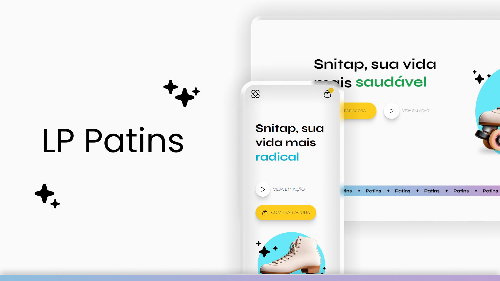

# Projeto Blogzada

<br/>

<p align="center">
  
</p>

<div align="center">

[](#-tecnologias)  
[](#-projeto)  
[](#memo-licença)  

</div>

---

## Sobre o Projeto

Essa é a **LP Snitap**, Uma LP simples de Patins, feita atráves do curso da Rocketseat.

- **Objetivo:** Praticar **responsividade** e colocar em uso algumas **bibliotecas** que criei, além de aplicar o que aprendi.
- **Em prática:** Uso de **SCSS avançado**, animações **CSS** para dar mais vida aos elementos, feito com **grid de 12 colunas**.

<br/>

## Tecnologias

Este projeto foi desenvolvido com as seguintes tecnologias:

- **HTML5**
- **CSS**
- **SCSS**


---

## Objetivos do Projeto

- Criar uma **Landing Page moderna**.  
- Utilizar **SCSS avançado** para estilizações e animações mais sofisticadas.  
- Implementar práticas de **responsividade avançada** e efeitos de scroll (feito pelo **VIEW**).  

---

## Preview do Projeto

<div align="center">
  
</div>

---

## 🔗 Links Úteis

- [Navegue pelo Site](https://fonsez.github.io/LP-Patins/)
- [LinkedIn](https://www.linkedin.com/in/fonses/)
- [Portifa](https://fonsez.github.io/port/)

---

## Como Executar o Projeto

1. **Clone o repositório:**  
   ```bash
   git clone https://github.com/Fonsez/LP-Patins
